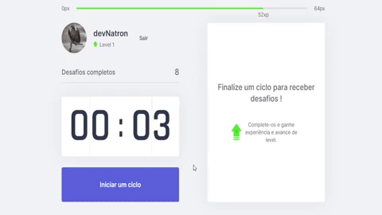

 # Pomodoro Web App

<!---Esses são exemplos. Veja https://shields.io para outras pessoas ou para personalizar este conjunto de escudos. Você pode querer incluir dependências, status do projeto e informações de licença aqui--->

<!--


--->


> Um pomodoro web app gamificado inspirado na tecnica de pomodoro.

### Recursos disponíveis

* Relógio Pomodoro
* Exercícios ao encerrar um ciclo
* Notificações
* Signin autenticado com GitHub

### Ajustes e melhorias

- [ ] Modo noturno
- [ ] Regulagem dos ciclos
- [ ] Login como convidado
- [ ] Progressive web app

## 💻 Pré-requisitos

Antes de começar, verifique se você atendeu aos seguintes requisitos:
* ter a versão mais recente de `npm ou yarn`
* ter a versão mais recente de `node`

## 🚀 Instalando o projeto

Para instalar, siga estas etapas:

Clone o repositório na sua maquina:
```
git clone git@github.com:devNatron/pomodoro-web-app.git
```
Navegue até a pasta do projeto e instale as dependências:
```
cd pomodoro-web-app
npm install
```

## ☕ Usando

Para usar, siga estas etapas:

para iniciar o projeto em modo desenvolvimento:
```
npm run dev
```
para gerar o build e iniciar em produção:
```
npm run build
npm run start
```

## 📝 Licença

Esse projeto está sob licença MIT.

[⬆ Voltar ao topo](#pomodoro-web-app)<br>
